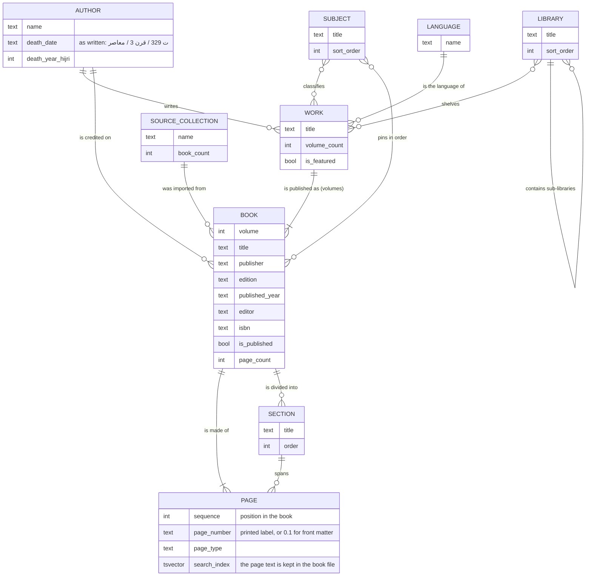

# Entity-relationship diagram (conceptual)

The library's entities and how they relate, without join tables, foreign-key columns or the
technical tables. The physical tables are in the migrations (`database/migrations/versions`).

## Reading it

- A **work** is a title by an author; its **books** are its volumes (one book for a single-volume work).
  Pages and sections belong to a book.
- A work can belong to many **subjects** and many **libraries** (a tree of libraries inside libraries);
  each of those can hold many works.
- A subject can pin books in a chosen order.
- Not shown: the technical tables (change log for the apps' catalog sync, import history, schema version).
