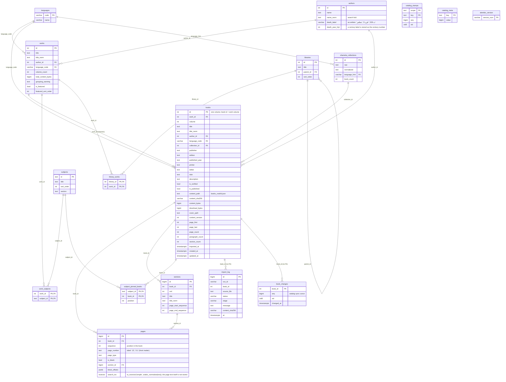

# Database ER diagram

PostgreSQL 17, schema `public`, as created by the Alembic migrations (head `5e7a2c9d41b3`).
Render with any Mermaid viewer (GitHub shows it inline).

## How it reads

- **Catalog:** a **work** (a title by an author) has one or more **books** (its volumes). Works belong to
  many **subjects** (`work_subjects`) and to many **libraries** (`library_works`, a separate tree through
  `parent_id`). `subject_pinned_books` fixes the order of chosen books inside a subject.
- **Content:** a book's text lives in `books_root/<id>.json`; the database keeps its **pages** (position,
  label, the search index `search_tsv`) and its **sections** (the table of contents), not the text.
- **Search:** `pages.search_tsv` (GIN index). Search orders results by the author's death year
  (`authors.death_year_hijri`, or the middle of the century for a «قرن N» label), then work title, volume, page.
- **Sync for the apps:** `book_changes`, `catalog_stamps` and `catalog_meta` are the change log the iPhone apps
  read to update their catalog; they are written by database triggers, not by the application.
- **Bookkeeping:** `import_log` (one row per import attempt, `book_id` is not a foreign key so a deleted book's
  history stays), `shamela_collections` (the source collection names books were imported under) and
  `alembic_version`.
